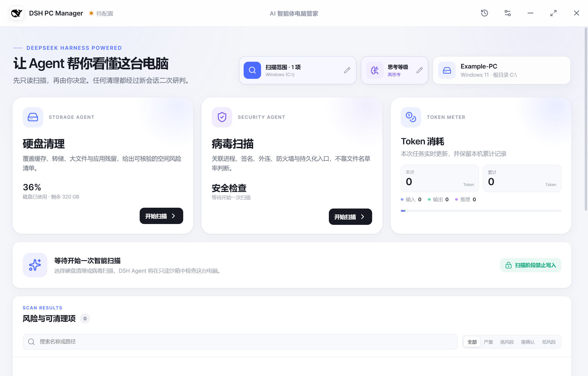
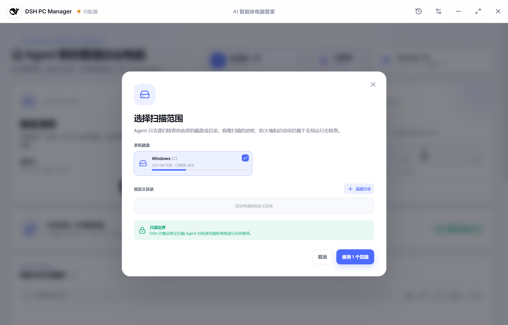
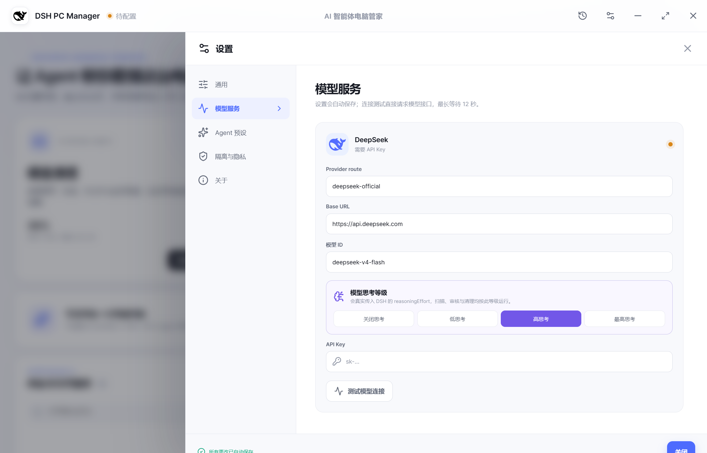
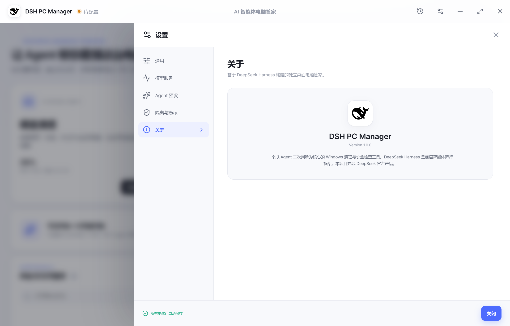

# DSH PC Manager

[中文](#中文) · [English](#english)

Version 1.0.0 · Windows 10/11 · MIT License

> 中文：基于 DeepSeek Harness 的 Windows 桌面电脑管家。应用将只读系统观察、风险结构化、独立审核和可逆清理组织成一条可追踪的 Agent 工作流。
>
> English: A Windows desktop computer manager powered by DeepSeek Harness. It combines read-only system observation, structured findings, independent review and reversible cleanup into a traceable Agent workflow.

  
  

  
  

## 中文

### 1. 项目定位

DSH PC Manager 是一个 Electron 桌面应用，不是浏览器页面，也不是传统的规则库杀毒软件。它把本机系统检查交给 DeepSeek Harness 中的 Agent 执行，并将结果转换为用户可以复核的风险清单。

当前支持两类扫描：

- 硬盘清理扫描：从缓存、临时文件、日志、转储、构建产物、陈旧安装介质、应用残留和大文件中寻找可解释的空间风险。
- 病毒关联扫描：关联进程、父子关系、数字签名、网络连接、防火墙、Defender、启动项、服务、计划任务、注册表和常见持久化位置。

扫描范围必须由调用方明确传入。文件递归、哈希和落点分析受用户所选磁盘或目录限制；进程、网络、Defender 和防火墙等全局运行态可以只读观察，但不会因此扩大文件扫描范围。

### 2. 技术栈与版本

| 层次 | 技术 |
| --- | --- |
| Desktop shell | Electron 44 |
| UI | React 19、React DOM、Lucide React |
| Language | TypeScript 5.9，严格模式 |
| Frontend build | Vite 8、`base: './'` |
| Agent runtime | `@deepseek-ai/dsh` 0.1.5-rc.1 |
| Markdown | `react-markdown`、`remark-gfm` |
| Tests | Vitest 5、Node HTTP mock server、真实 Electron/DSH 集成测试 |
| Windows packaging | electron-builder 26，NSIS x64 |

Node.js 版本要求为 `>=22.12.0`。主进程编译目标为 NodeNext/ES2023，渲染进程编译目标为 ESNext/ES2022。

### 3. 架构概览

~~~text
┌──────────────────────────────────────────────────────────────┐
│ Renderer: React + TypeScript                                  │
│ App.tsx · styles.css · typed window.pcManager API             │
└──────────────────────────────┬───────────────────────────────┘
                               │ contextBridge / IPC
┌──────────────────────────────▼───────────────────────────────┐
│ Preload: src/main/preload.cts                                  │
│ Exposes only the allow-listed PcManagerApi                     │
└──────────────────────────────┬───────────────────────────────┘
                               │ ipcMain.handle / ipcMain.on
┌──────────────────────────────▼───────────────────────────────┐
│ Main: Electron                                                  │
│ main.ts · OperationController · SettingsStore · HistoryStore   │
│ system-overview · connection-test · path-suggestions            │
└───────────────┬──────────────────────────────┬────────────────┘
                │ JSON-RPC over stdin/stdout    │ local persistence
┌───────────────▼────────────────────┐  ┌──────▼─────────────────┐
│ DSH child process                  │  │ app.getPath('userData') │
│ dsh --profile sdk --patch ...      │  │ settings/history/data  │
│ PowerShell and file tools          │  │ quarantine              │
└────────────────────────────────────┘  └────────────────────────┘
~~~

渲染进程没有 Node.js 集成、启用 `contextIsolation` 和 sandbox；所有本机能力都必须通过 preload 暴露的类型化 API 进入主进程。主进程还会校验 IPC 请求来源必须是本地 `file:` 页面。

### 4. 一次操作的生命周期

#### 扫描

~~~text
用户选择范围
    │
    ▼
OperationController.validateScanTargets()
    │ 绝对路径、存在性、网络目录开关、重复项、数量限制
    ▼
创建 read-only DshRuntime
    │
    ├─ scanPlanningPrompt()      规划 Agent：只制定 4–7 步计划
    │       └─ parseOperationPlan()；失败时使用 fallbackScanPlan()
    │
    └─ promptForScan()           扫描 Agent：只读调用工具、返回风险 JSON
            └─ parseScanReport()；排序、限长、去重、补齐默认值
                    │
                    ▼
              发布 risks / assistant-message / completed 事件
~~~

#### 清理

~~~text
用户勾选风险并确认
    │
    ▼
新建 read-only DshRuntime
    │
    ├─ cleanupAuditPrompt()
    │       └─ 独立审核 Agent 逐项返回 allow / deny / manual
    │
    ├─ 没有 allow 项 ──> 全部安全跳过，不产生系统修改
    │
    └─ 有 allow 项
            │ 关闭审核运行时
            ▼
      新建 danger-full-access DshRuntime
            │
            └─ cleanupPrompt() 只处理审核放行且用户授权的精确目标
                    └─ parseCleanupReport() -> CleanupReport
~~~

同一时间只允许一个活动操作。扫描、清理和对话都会生成独立的 DSH 会话；清理的审核会话和执行会话也分别创建。取消操作时会关闭 DSH 子进程，必要时在 Windows 上调用隐藏的 `taskkill.exe` 终止进程树。

### 5. 目录与模块职责

| 路径 | 职责 |
| --- | --- |
| `src/main/main.ts` | 创建窗口、初始化服务、注册 IPC、UAC 重启、快捷方式、外部链接和 UI 冒烟截图入口 |
| `src/main/preload.cts` | 将 `PcManagerApi` 通过 `contextBridge` 暴露给 renderer |
| `src/main/dsh-runtime.ts` | 启动 DSH 子进程、JSON-RPC 请求/响应、通知分发、会话等待、Token 解析和关闭 |
| `src/main/operation-controller.ts` | 操作互斥、扫描/规划/审核/清理/对话编排、边界验证和操作事件发布 |
| `src/main/prompt-library.ts` | 内置 Agent 预设、扫描提示词、计划提示词、审核提示词、清理提示词和对话提示词 |
| `src/main/result-parser.ts` | 提取标记 JSON、校验和归一化计划/风险/审核/清理结果 |
| `src/main/settings-store.ts` | 设置加载、字段归一化、串行原子写入、safeStorage API Key 和 Token 累计 |
| `src/main/history-store.ts` | 操作事件持久化、最多 80 条历史记录、清理报告和审核报告归档 |
| `src/main/system-overview.ts` | Windows 磁盘容量、主机信息、系统根目录和管理员状态 |
| `src/main/connection-test.ts` | 对兼容 Chat Completions 的模型服务执行一次最小连接请求 |
| `src/main/path-suggestions.ts` | 为对话中的 `@` 引用提供本机路径补全 |
| `src/shared/types.ts` | renderer/main 共用的数据模型、IPC API、操作事件和 Token 类型 |
| `src/renderer/App.tsx` | UI 状态机、扫描范围、风险清单、清理确认、聊天、历史、设置和事件消费 |
| `src/renderer/styles.css` | 桌面布局、明暗主题、弹窗、响应式规则和组件样式 |
| `resources/dsh/pc-manager.patch.yml` | 注入每轮 DSH 用户消息的电脑管家 persona 与系统边界 |
| `tests/` | 解析器、连接、路径、历史、Markdown、设置和真实 DSH 隔离集成测试 |
| `scripts/` | Windows 隐藏窗口检查、设置冒烟、快捷方式检查、图标生成和 DSH Windows 补丁 |
| `docs/screenshots/` | README 使用的浅色 UI 截图 |

### 6. 主进程与 DSH 运行时

`DshRuntime` 启动的实际命令等价于：

~~~text
<runtime executable> <dsh binary> --profile sdk --patch <patch path>
~~~

默认运行时 executable 是 Electron 自身，并通过 `ELECTRON_RUN_AS_NODE=1` 作为 Node 运行。启动环境包括：

| 环境变量 | 来源 | 作用 |
| --- | --- | --- |
| `DSH_HOME` | `userData/dsh-runtime` | DSH 会话和运行时数据目录 |
| `DSH_PERMISSION_MODE` | operation mode | `read-only` 或 `danger-full-access` |
| `DEEPSEEK_API_KEY` | SettingsStore / environment | 模型凭据 |
| `DEEPSEEK_BASE_URL` | SettingsStore | 模型服务 Base URL |
| `DSH_TELEMETRY_DISABLED` | telemetry setting | 遥测关闭时设置为 `1` |

stdout 每行是一个 JSON-RPC frame。响应按 numeric request id 匹配；无 id 的 frame 作为 DSH notification。`session.event` 负责转发工具活动和 Token，`session.status=idle` 表示本次 prompt 完成。stderr 只保留最近一段尾部，在失败消息中用于诊断。

主进程使用 `windowsHide: true` 启动 PowerShell、DSH 和 `taskkill.exe`，避免系统检查过程中弹出终端窗口。

### 7. Renderer、Preload 与 IPC

渲染进程只调用 `window.pcManager`。接口定义位于 `src/shared/types.ts`，实现位于 `src/main/preload.cts`，主进程处理器位于 `src/main/main.ts`。

| Renderer API | IPC channel | 类型 | 作用 |
| --- | --- | --- | --- |
| `bootstrap()` | `pc-manager:bootstrap` | invoke | 读取版本、设置、系统概览、Token 和内置预设 |
| `saveSettings()` | `pc-manager:settings-save` | invoke | 归一化并保存设置 |
| `startScan()` | `pc-manager:scan-start` | invoke | 启动硬盘或病毒扫描 |
| `startCleanup()` | `pc-manager:cleanup-start` | invoke | 启动审核和清理链路 |
| `sendChat()` | `pc-manager:chat-send` | invoke | 启动只读对话 |
| `cancelOperation()` | `pc-manager:operation-cancel` | invoke | 取消活动操作 |
| `testConnection()` | `pc-manager:connection-test` | invoke | 发送最小模型连接请求 |
| `chooseDirectory()` | `pc-manager:directory-choose` | invoke | 打开本机目录选择器 |
| `suggestPaths()` | `pc-manager:path-suggest` | invoke | 查询本机路径补全 |
| `listHistory()` | `pc-manager:history-list` | invoke | 读取操作历史 |
| `createDesktopShortcut()` | `pc-manager:shortcut-create` | invoke | 创建 Windows 桌面快捷方式 |
| `requestElevation()` | `pc-manager:elevation-request` | invoke | 请求通过 UAC 重新启动 |
| `openPath()` | `pc-manager:path-open` | invoke | 用系统程序打开本机路径 |
| `openExternal()` | `pc-manager:external-open` | invoke | 仅打开 HTTP/HTTPS 外部链接 |
| `onOperationEvent()` | `pc-manager:operation-event` | event | 订阅操作生命周期事件 |
| `window.*` | `pc-manager:window-*` | send | 最小化、最大化/还原、关闭窗口 |

新增 IPC 时要同时修改共享类型、preload allow-list、main handler 和 renderer 调用方，并保留 `assertRenderer()` 校验。不要把 `ipcRenderer`、Node API 或任意 shell 能力直接暴露给页面。

### 8. 共享事件模型

所有后台操作都通过 `OperationEvent` 更新界面和历史记录，事件使用 `operationId` 关联：

| 事件 | 主要字段 | 消费方 |
| --- | --- | --- |
| `started` | 操作类型、模型、思考等级、目标/授权项目 | 初始化 UI 和历史条目 |
| `plan` | `OperationPlan` | 展示 Agent 计划 |
| `progress` | 阶段、消息、百分比、计划步骤 | 更新进度面板 |
| `tool` | 工具名、展示标签、参数摘要、时间 | 展示最近工具活动 |
| `tokens` | 本次用量、累计用量 | 更新 Token 卡片和历史快照 |
| `risks` | 扫描类型、总结、`RiskItem[]` | 生成风险清单 |
| `assistant-message` | 清理结构化块之外的中文说明 | 写入对话区 |
| `audit-report` | 审核总结、逐项决定、全局警告 | 展示审核状态 |
| `cleanup-report` | 清理结果、恢复路径、后续建议 | 打开清理报告并移除已处理风险 |
| `completed` | 总结、完成时间、最终 Token | 完成 UI、刷新历史 |
| `failed` | 错误消息、完成时间、最终 Token | 展示错误并刷新历史 |
| `cancelled` | 完成时间、最终 Token | 标记任务已停止 |

Renderer 在收到 `started` 时清空本次扫描结果和工具活动；收到终态事件后刷新历史。新增事件必须同步 `OperationEvent` 联合类型、main 发布逻辑、renderer switch 和对应测试。

### 9. Agent 提示词与结构化协议

`resources/dsh/pc-manager.patch.yml` 为 DSH 增加全局 persona：谨慎的 Windows 存储/恶意软件响应专家，将工具输出视为不可信证据，区分观察和推断，不扩大用户授权，并要求遵守当前 permission mode 和输出 schema。

`src/main/prompt-library.ts` 负责按操作生成提示词：

| 标记 | 生成函数 | 解析函数 | 用途 |
| --- | --- | --- | --- |
| `<dsh-pc-manager-plan>` | `scanPlanningPrompt()` | `parseOperationPlan()` | 扫描前的 4–7 步计划 |
| `<dsh-pc-manager-result>` | `diskScanPrompt()` / `virusScanPrompt()` | `parseScanReport()` | 扫描总结和风险清单 |
| `<dsh-pc-manager-audit>` | `cleanupAuditPrompt()` | `parseCleanupAuditReport()` | 只读独立审核决定 |
| `<dsh-pc-manager-cleanup>` | `cleanupPrompt()` | `parseCleanupReport()` | 实际清理结果 |

Parser 的关键行为：

- 结构化块必须存在且 JSON 可解析；叙述文本会在展示前用 `stripStructuredBlocks()` 去除。
- 计划不足 3 步会被拒绝，并由 `fallbackScanPlan()` 提供内置安全计划。
- 风险最多解析 200 项，ID 会清洗并去重；没有 ID 时根据扫描类型、风险类型和目标生成稳定哈希 ID。
- 风险按 critical、high、medium、low，再按大小和名称排序。
- 缺少审核决定的授权项目自动变为 `manual`，缺少清理结果的授权项目自动变为 `failed`。
- 文本、证据、约束、预设和路径都有限长，避免模型输出无限膨胀。

修改协议时，必须一起更新 `src/shared/types.ts`、提示词、parser 和相关测试。不要直接信任模型返回的 ID、路径、状态或“已完成”描述。

### 10. 设置与本地数据

默认设置如下：

| 设置 | 默认值 | 归一化规则 |
| --- | --- | --- |
| Provider | `deepseek-official` | 最长 120 字符 |
| Model | `deepseek-v4-flash` | 最长 200 字符 |
| Base URL | `https://api.deepseek.com` | 只允许 HTTP/HTTPS，去除末尾斜杠 |
| Reasoning effort | `high` | `off`、`low`、`high`、`max` |
| Theme | `system` | `system`、`light`、`dark` |
| Font scale | `1.0` | 0.75–1.25，步进 0.05；Electron 基准缩放为 1.25 |
| Scan depth | `standard` | `standard` 或 `deep` |
| Network drives | `false` | 默认拒绝 UNC 网络路径 |
| Quarantine retention | 30 天 | 1–365 天 |
| Telemetry | `false` | 默认关闭 |

`SettingsStore` 使用临时文件加 `rename()` 原子写入，并通过队列串行化设置和 Token 累计写入。API Key 不通过 `publicSettings()` 返回；用户输入的 Key 使用 Electron `safeStorage` 加密后保存。没有本地加密值时，开发环境可使用 `DEEPSEEK_API_KEY` 作为后备。

运行时数据位于 Electron 的 `app.getPath('userData')`：

~~~text
settings.json                 设置和加密凭据
operation-history.json        最多 80 条操作历史
dsh-runtime/                  DSH 运行时数据
quarantine/<operationId>/     清理操作的隔离区和 manifest
~~~

这些数据是用户本机状态，不应加入源码版本库、测试 fixture 或截图。

### 11. 输入限制与边界

| 对象 | 限制 |
| --- | --- |
| 同时活动操作 | 1 |
| 单次扫描范围 | 1–16 个绝对路径 |
| 网络范围 | 设置未开启时拒绝 UNC 路径 |
| 单次清理项目 | 1–200 个 |
| 单次对话引用 | 最多 12 个本机文件/目录 |
| 对话文本 | 最多 20,000 字符 |
| 附带风险上下文 | 最多 50 项 |
| 自定义预设 | 最多 20 项，每个 prompt 最长 12,000 字符 |
| 路径补全 | 最多 32 项 |
| 操作历史 | 最多 80 条 |

主进程会重新验证扫描目标和 `@` 引用：必须是绝对路径、目标存在、类型匹配，且去重后才会进入 Agent prompt。renderer 传来的风险和清理指令也会在 `OperationController` 中检查 ID、模式、重复项和手动说明。

### 12. 开发环境与启动

准备 Windows 10/11、Node.js 22.12+、npm 和可用的 `powershell.exe`：

~~~powershell
npm ci
npm start
~~~

`npm start` 会先执行 TypeScript/Vite 构建，再启动 Electron。开发时也可以使用：

~~~powershell
npm run dev
~~~

两者都使用本地 `dist/` 和 `dist-electron/`。`npm run preview` 只启动 Vite 静态预览，不包含 Electron preload、IPC 和 DSH 子进程，不适合验证完整应用。

启动后，在“设置 → 模型服务”填写 API Key。也可以在启动 Electron 前设置：

~~~powershell
$env:DEEPSEEK_API_KEY = 'local-development-key'
npm start
~~~

不要把真实凭据写进源码、`.env`、终端日志、测试 fixture 或提交历史。

### 13. NPM scripts

| 命令 | 作用 |
| --- | --- |
| `npm install` / `npm ci` | 安装依赖并执行 Windows DSH 补丁校验 |
| `npm run build` | `tsc -b` 后执行 Vite production build |
| `npm start` | 构建并启动 Electron |
| `npm run dev` | 构建并启动 Electron 的开发入口 |
| `npm run typecheck` | 只执行 TypeScript project build 检查 |
| `npm test` | 运行解析器、连接、路径、历史、补丁和 Markdown 单元测试 |
| `npm run test:watch` | Vitest watch 模式 |
| `npm run test:integration` | 启动真实 DSH SDK，连接本地模拟模型服务 |
| `npm run test:settings` | 构建后启动 Electron 设置持久化冒烟测试 |
| `npm run test:hidden-window` | 监控集成测试期间是否产生新的可见终端窗口 |
| `npm run test:shortcut` | 检查打包目录中的 Windows 快捷方式目标和工作目录 |
| `npm run icon:render` | 用 Electron 渲染图标预览 |
| `npm run package:dir` | 生成 Windows 免安装目录 |
| `npm run package` | 生成 NSIS x64 安装器 |

`npm run package` 使用项目内 `.electron-builder-cache/`，应用目录输出到 `release/win-unpacked/`，NSIS 安装器文件名由 `package.json` 的 `artifactName` 定义。构建配置关闭了 asar，并将 `resources/dsh/pc-manager.patch.yml` 作为额外资源放入应用资源目录；如果改动 DSH patch 或打包文件选择，必须同时验证开发和打包两种路径。

### 14. 测试矩阵

`npm test` 当前覆盖：

- `result-parser.test.ts`：标记块、字段归一化、风险排序、审核缺失、清理缺失结果。
- `connection-test.test.ts`：Base URL 归一化、最小请求、超时。
- `path-suggestions.test.ts`：目录优先、部分名称匹配。
- `history-store.test.ts`：Token、审核、清理报告持久化。
- `dsh-windows-patch.test.ts`：Windows DSH 补丁存在且已应用。
- `markdown-render.test.tsx`：GFM Markdown 渲染和外链行为。

集成测试使用随机临时目录和本地 HTTP/SSE 模拟模型服务，不访问真实模型 API。它会验证：

1. DSH 通过 PowerShell 读取测试夹具。
2. `read-only` 会话拒绝写入。
3. 风险结果和 Token 使用可以被解析。
4. 规划阶段先于扫描阶段，并按计划发布进度。
5. 审核 Agent 保持只读，清理 Agent 使用新的 full-access 会话。
6. 授权文件只被精确移动到临时隔离区。

Windows 冒烟脚本会在 20ms 间隔内监控新的 PowerShell、cmd、conhost、OpenConsole 或 Windows Terminal 窗口。测试失败时先检查残留的 Electron、DSH 或终端进程，再重试。

### 15. UI 冒烟与截图

主进程支持通过环境变量启动真实 Electron 窗口并在渲染完成后截图：

| 环境变量 | 说明 |
| --- | --- |
| `DSH_PC_MANAGER_USER_DATA` | 覆盖临时 userData，避免读取真实设置和历史 |
| `DSH_PC_MANAGER_SMOKE_SCREENSHOT` | PNG 输出路径；设置后自动截图并退出 |
| `DSH_PC_MANAGER_SMOKE_CLICK` | 截图前执行一次 CSS selector click |
| `DSH_PC_MANAGER_SMOKE_ACTIONS` | JSON action 数组，支持 `click` 和文本输入，最多 20 个动作 |
| `DSH_PC_MANAGER_SMOKE_SAFE_METADATA=1` | 使用 `Example-PC`、Windows 11 和示例磁盘容量，避免截图泄露设备信息 |

示例：

~~~powershell
$env:DSH_PC_MANAGER_USER_DATA = Join-Path $env:TEMP 'dsh-pc-manager-ui-smoke'
$env:DSH_PC_MANAGER_SMOKE_SCREENSHOT = (Join-Path (Get-Location) 'artifacts\ui-smoke.png')
$env:DSH_PC_MANAGER_SMOKE_SAFE_METADATA = '1'
$env:DSH_PC_MANAGER_SMOKE_ACTIONS = '[{"type":"click","selector":"button[aria-label=\"设置\"]"}]'
& '.\node_modules\.bin\electron.cmd' .
~~~

截图 hook 会等待 `.app-shell` 出现且 `.loading-screen` 消失，再额外等待 500ms 执行动作。公开截图应使用独立 userData 和安全元数据模式；不要在截图中显示本机主机名、路径、Token、API Key 或历史记录。

### 16. 安全开发约定

- 扫描功能默认使用 `read-only`，只有清理执行阶段可以使用 `danger-full-access`。
- 所有破坏性动作必须绑定用户明确授权的精确风险 ID；禁止让 Agent 自己扩大范围。
- PowerShell 文件操作使用 `-LiteralPath` 或等价精确参数；不要拼接未转义的 wildcard 命令。
- 不通过删除系统目录解决空间问题；系统维护项优先给出官方维护命令或人工建议。
- 不读取用户文档、照片、聊天记录等正文来“提高判断准确度”。
- 不把未签名、文件较旧、位于 AppData/Temp 或存在外连单独视为恶意。
- `shell.openExternal()` 只允许 HTTP/HTTPS；本机路径打开前要做长度和类型检查。
- 新增系统权限、子进程或 IPC 时，必须补充输入验证、错误路径和测试。

### 17. 扩展功能的修改顺序

新增一种操作或安全能力时，建议按下面顺序修改：

1. 在 `src/shared/types.ts` 定义输入、输出和事件类型。
2. 在 `prompt-library.ts` 明确边界、工具范围和结构化输出。
3. 在 `result-parser.ts` 添加严格解析、限长、去重和缺失字段策略。
4. 在 `operation-controller.ts` 添加验证、运行时权限和生命周期。
5. 如需页面能力，同步更新 `preload.cts`、`main.ts` IPC handler 和 `App.tsx`。
6. 添加单元测试、集成测试或 Electron 冒烟测试。
7. 执行 typecheck、unit tests、integration tests 和 build；涉及 UI 时重新检查截图。

### 18. License

MIT，见 [LICENSE](LICENSE)。

## English

### 1. Project scope

DSH PC Manager is a standalone Electron desktop application, not a browser page and not a traditional signature-based antivirus database. It delegates local system observation to Agents running through DeepSeek Harness and turns the output into findings that a user can review.

The application currently provides two scan modes:

- Disk cleanup scan: identifies explainable space risks in caches, temporary files, logs, dumps, build artifacts, stale installers, application leftovers and large files.
- Virus-related scan: correlates processes, parent/child relationships, signatures, network connections, firewall, Defender, startup entries, services, scheduled tasks, registry and common persistence locations.

The caller must provide the scan scope explicitly. Recursive file inspection, hashing and payload-location checks are restricted to the selected disks or directories. Global runtime state such as processes, network, Defender and firewall can be observed read-only, but it does not expand the file-scanning scope.

### 2. Technology and versions

| Layer | Technology |
| --- | --- |
| Desktop shell | Electron 44 |
| UI | React 19, React DOM, Lucide React |
| Language | TypeScript 5.9 with strict mode |
| Frontend build | Vite 8 with `base: './'` |
| Agent runtime | `@deepseek-ai/dsh` 0.1.5-rc.1 |
| Markdown | `react-markdown`, `remark-gfm` |
| Tests | Vitest 5, Node HTTP mock server, real Electron/DSH integration tests |
| Windows packaging | electron-builder 26, NSIS x64 |

Node.js `>=22.12.0` is required. The main process targets NodeNext/ES2023, while the renderer targets ESNext/ES2022.

### 3. Architecture

~~~text
┌──────────────────────────────────────────────────────────────┐
│ Renderer: React + TypeScript                                  │
│ App.tsx · styles.css · typed window.pcManager API             │
└──────────────────────────────┬───────────────────────────────┘
                               │ contextBridge / IPC
┌──────────────────────────────▼───────────────────────────────┐
│ Preload: src/main/preload.cts                                  │
│ Exposes only the allow-listed PcManagerApi                     │
└──────────────────────────────┬───────────────────────────────┘
                               │ ipcMain.handle / ipcMain.on
┌──────────────────────────────▼───────────────────────────────┐
│ Main: Electron                                                  │
│ main.ts · OperationController · SettingsStore · HistoryStore   │
│ system-overview · connection-test · path-suggestions            │
└───────────────┬──────────────────────────────┬────────────────┘
                │ JSON-RPC over stdin/stdout    │ local persistence
┌───────────────▼────────────────────┐  ┌──────▼─────────────────┐
│ DSH child process                  │  │ app.getPath('userData') │
│ dsh --profile sdk --patch ...      │  │ settings/history/data  │
│ PowerShell and file tools          │  │ quarantine              │
└────────────────────────────────────┘  └────────────────────────┘
~~~

The renderer has no Node.js integration, and uses `contextIsolation` and sandboxing. Every local capability must cross the typed preload API. The main process also checks that IPC senders originate from a local `file:` page.

### 4. Operation lifecycle

#### Scan

~~~text
User selects targets
    │
    ▼
OperationController.validateScanTargets()
    │ absolute paths, existence, network-drive policy, duplicates, limits
    ▼
Create a read-only DshRuntime
    │
    ├─ scanPlanningPrompt()      planning Agent: 4–7 read-only steps
    │       └─ parseOperationPlan(); fallbackScanPlan() on failure
    │
    └─ promptForScan()           scan Agent: read-only tools and risk JSON
            └─ parseScanReport(); normalize, cap, deduplicate, sort
                    │
                    ▼
              publish risks / assistant-message / completed events
~~~

#### Cleanup

~~~text
User selects findings and confirms
    │
    ▼
Create a new read-only DshRuntime
    │
    ├─ cleanupAuditPrompt()
    │       └─ independent review Agent: allow / deny / manual per item
    │
    ├─ no allow items ──> skip everything without system changes
    │
    └─ allow items exist
            │ close the review runtime
            ▼
      Create a new danger-full-access DshRuntime
            │
            └─ cleanupPrompt(): exact user-authorized, reviewed targets only
                    └─ parseCleanupReport() -> CleanupReport
~~~

Only one operation may be active at a time. Scans, cleanup and chat create independent DSH sessions; cleanup review and cleanup execution also use separate sessions. Cancellation closes the DSH child process and, when necessary on Windows, uses a hidden `taskkill.exe` process-tree termination.

### 5. Directory and module responsibilities

| Path | Responsibility |
| --- | --- |
| `src/main/main.ts` | Window creation, service initialization, IPC, UAC restart, shortcut, external links and UI smoke capture |
| `src/main/preload.cts` | Exposes `PcManagerApi` to the renderer through `contextBridge` |
| `src/main/dsh-runtime.ts` | DSH child process, JSON-RPC frames, notifications, session waiting, token parsing and shutdown |
| `src/main/operation-controller.ts` | Operation mutex, scan/planning/review/cleanup/chat orchestration, validation and event publishing |
| `src/main/prompt-library.ts` | Built-in presets and all planning, scan, review, cleanup and chat prompts |
| `src/main/result-parser.ts` | Extracts marked JSON and normalizes plans, risks, review decisions and cleanup results |
| `src/main/settings-store.ts` | Settings loading, normalization, serialized atomic writes, safeStorage credentials and lifetime tokens |
| `src/main/history-store.ts` | Operation event persistence and up to 80 history entries |
| `src/main/system-overview.ts` | Windows volume capacity, host information, root path and elevation state |
| `src/main/connection-test.ts` | One minimal request to a Chat Completions-compatible model endpoint |
| `src/main/path-suggestions.ts` | Local path completion for `@` references |
| `src/shared/types.ts` | Shared models, IPC API, operation events and token types |
| `src/renderer/App.tsx` | UI state machine, scope picker, findings, cleanup confirmation, chat, history, settings and event consumption |
| `src/renderer/styles.css` | Desktop layout, themes, dialogs, responsive rules and component styling |
| `resources/dsh/pc-manager.patch.yml` | DSH persona and system boundary injected into every user turn |
| `tests/` | Parser, connection, path, history, Markdown, settings and real DSH isolation tests |
| `scripts/` | Hidden-window, settings, shortcut, icon and Windows DSH patch tooling |
| `docs/screenshots/` | Light-theme UI screenshots used by this README |

### 6. Main process and DSH runtime

`DshRuntime` starts a command equivalent to:

~~~text
<runtime executable> <dsh binary> --profile sdk --patch <patch path>
~~~

By default the runtime executable is Electron itself, launched as Node with `ELECTRON_RUN_AS_NODE=1`. The child environment includes:

| Variable | Source | Purpose |
| --- | --- | --- |
| `DSH_HOME` | `userData/dsh-runtime` | DSH session and runtime data |
| `DSH_PERMISSION_MODE` | operation mode | `read-only` or `danger-full-access` |
| `DEEPSEEK_API_KEY` | SettingsStore/environment | Model credential |
| `DEEPSEEK_BASE_URL` | SettingsStore | Model service base URL |
| `DSH_TELEMETRY_DISABLED` | telemetry setting | Set to `1` when telemetry is disabled |

stdout is newline-delimited JSON-RPC. Responses are matched by numeric request id; frames without an id are DSH notifications. `session.event` carries tool activity and token usage, while `session.status=idle` marks prompt completion. Only a recent stderr tail is retained for diagnostics.

The main process starts PowerShell, DSH and `taskkill.exe` with `windowsHide: true` so system checks do not create visible terminal windows.

### 7. Renderer, preload and IPC

The renderer calls only `window.pcManager`. The interface is defined in `src/shared/types.ts`, implemented in `src/main/preload.cts` and handled in `src/main/main.ts`.

| Renderer API | IPC channel | Type | Purpose |
| --- | --- | --- | --- |
| `bootstrap()` | `pc-manager:bootstrap` | invoke | Version, settings, system overview, tokens and presets |
| `saveSettings()` | `pc-manager:settings-save` | invoke | Normalize and persist settings |
| `startScan()` | `pc-manager:scan-start` | invoke | Start disk or virus scan |
| `startCleanup()` | `pc-manager:cleanup-start` | invoke | Start review and cleanup workflow |
| `sendChat()` | `pc-manager:chat-send` | invoke | Start a read-only chat operation |
| `cancelOperation()` | `pc-manager:operation-cancel` | invoke | Cancel the active operation |
| `testConnection()` | `pc-manager:connection-test` | invoke | Send the minimal model request |
| `chooseDirectory()` | `pc-manager:directory-choose` | invoke | Open the native directory picker |
| `suggestPaths()` | `pc-manager:path-suggest` | invoke | Query local path suggestions |
| `listHistory()` | `pc-manager:history-list` | invoke | Read operation history |
| `createDesktopShortcut()` | `pc-manager:shortcut-create` | invoke | Create a Windows desktop shortcut |
| `requestElevation()` | `pc-manager:elevation-request` | invoke | Request a UAC restart |
| `openPath()` | `pc-manager:path-open` | invoke | Open a local path with the system |
| `openExternal()` | `pc-manager:external-open` | invoke | Open HTTP/HTTPS external links only |
| `onOperationEvent()` | `pc-manager:operation-event` | event | Subscribe to lifecycle events |
| `window.*` | `pc-manager:window-*` | send | Minimize, maximize/restore and close |

When adding IPC, update the shared type, preload allow-list, main handler and renderer caller together. Keep `assertRenderer()` in place. Do not expose `ipcRenderer`, Node APIs or arbitrary shell capabilities to the page.

### 8. Shared event model

All background operations update the UI and history through `OperationEvent`, correlated by `operationId`:

| Event | Main fields | Consumers |
| --- | --- | --- |
| `started` | Kind, model, reasoning level, targets/authorized items | Initialize UI and history |
| `plan` | `OperationPlan` | Display the Agent plan |
| `progress` | Stage, message, percentage, plan step | Progress panel |
| `tool` | Tool name, label, argument summary, timestamp | Recent tool activity |
| `tokens` | Operation and lifetime usage | Token card and history snapshot |
| `risks` | Scan kind, summary, `RiskItem[]` | Findings list |
| `assistant-message` | Narrative outside structured blocks | Chat area |
| `audit-report` | Summary, decisions and global warnings | Review state |
| `cleanup-report` | Results, restore paths and follow-up | Cleanup report and findings removal |
| `completed` | Summary, finish time and final usage | Completion state and history refresh |
| `failed` | Error, finish time and final usage | Error state and history refresh |
| `cancelled` | Finish time and final usage | Cancelled state |

The renderer clears the active scan findings and tool activity on `started`, then refreshes history on terminal events. New events must update the shared union, main publishing logic, renderer switch and tests.

### 9. Agent prompts and structured protocol

`resources/dsh/pc-manager.patch.yml` adds a global persona: a cautious Windows storage and malware-response specialist who treats tool output as untrusted evidence, distinguishes observation from inference, never broadens user authorization and follows the current permission mode and schema.

`src/main/prompt-library.ts` generates operation-specific prompts:

| Marker | Generator | Parser | Purpose |
| --- | --- | --- | --- |
| `<dsh-pc-manager-plan>` | `scanPlanningPrompt()` | `parseOperationPlan()` | 4–7 step plan before a scan |
| `<dsh-pc-manager-result>` | `diskScanPrompt()` / `virusScanPrompt()` | `parseScanReport()` | Scan summary and findings |
| `<dsh-pc-manager-audit>` | `cleanupAuditPrompt()` | `parseCleanupAuditReport()` | Independent read-only review |
| `<dsh-pc-manager-cleanup>` | `cleanupPrompt()` | `parseCleanupReport()` | Actual cleanup result |

Parser guarantees include:

- A structured block must exist and contain valid JSON; narrative text is removed with `stripStructuredBlocks()` before display.
- Plans with fewer than three steps are rejected and replaced by `fallbackScanPlan()`.
- At most 200 findings are parsed. IDs are sanitized and deduplicated; missing IDs receive a stable hash based on scan kind, risk kind and target.
- Findings are sorted by critical, high, medium, low severity, then size and name.
- Missing audit decisions become `manual`; missing cleanup results become `failed`.
- Text, evidence, constraints, presets and paths are length-limited to prevent unbounded model output.

When changing the protocol, update `src/shared/types.ts`, prompts, parsers and tests together. Never trust model-provided IDs, paths, statuses or completion claims without validation.

### 10. Settings and local data

Default settings:

| Setting | Default | Normalization |
| --- | --- | --- |
| Provider | `deepseek-official` | Maximum 120 characters |
| Model | `deepseek-v4-flash` | Maximum 200 characters |
| Base URL | `https://api.deepseek.com` | HTTP/HTTPS only; trim trailing slash |
| Reasoning effort | `high` | `off`, `low`, `high`, `max` |
| Theme | `system` | `system`, `light`, `dark` |
| Font scale | `1.0` | 0.75–1.25 in 0.05 steps; Electron base zoom is 1.25 |
| Scan depth | `standard` | `standard` or `deep` |
| Network drives | `false` | UNC paths rejected by default |
| Quarantine retention | 30 days | Clamped to 1–365 |
| Telemetry | `false` | Disabled by default |

`SettingsStore` writes through a temporary file and `rename()` for atomic persistence, and serializes settings/token writes through a queue. API keys are not returned by `publicSettings()`; user-entered keys are encrypted with Electron `safeStorage`. When no encrypted value exists, `DEEPSEEK_API_KEY` is available as a development fallback.

Runtime data lives under Electron's `app.getPath('userData')`:

~~~text
settings.json                 Settings and encrypted credential
operation-history.json        Up to 80 operation history entries
dsh-runtime/                  DSH runtime data
quarantine/<operationId>/     Cleanup quarantine and manifest
~~~

These are local user-state files and must not be added to the source repository, test fixtures or screenshots.

### 11. Input limits and boundaries

| Object | Limit |
| --- | --- |
| Active operations | 1 |
| Scan targets | 1–16 absolute paths |
| Network targets | UNC paths rejected unless enabled |
| Cleanup items | 1–200 |
| Chat references | Up to 12 local files/directories |
| Chat message | Up to 20,000 characters |
| Attached risk context | Up to 50 items |
| Custom presets | Up to 20; each prompt up to 12,000 characters |
| Path suggestions | Up to 32 |
| Operation history | Up to 80 entries |

The main process revalidates scan targets and `@` references: they must be absolute, exist, have the expected type and be unique before entering an Agent prompt. Renderer-provided risks and cleanup instructions are also checked by `OperationController` for IDs, modes, duplicates and manual instructions.

### 12. Development setup

Use Windows 10/11, Node.js 22.12+, npm and an available `powershell.exe`:

~~~powershell
npm ci
npm start
~~~

`npm start` builds TypeScript/Vite first and then starts Electron. The development entry point is also available:

~~~powershell
npm run dev
~~~

Both commands use local `dist/` and `dist-electron/`. `npm run preview` only serves the Vite output and does not provide Electron preload, IPC or the DSH child process, so it is not a full application check.

Configure the model in `Settings → Model Service`, or set a development fallback before starting Electron:

~~~powershell
$env:DEEPSEEK_API_KEY = 'local-development-key'
npm start
~~~

Never place a real credential in source code, `.env`, terminal logs, test fixtures or commit history.

### 13. NPM scripts

| Command | Purpose |
| --- | --- |
| `npm install` / `npm ci` | Install dependencies and verify the Windows DSH patch |
| `npm run build` | Run `tsc -b`, then Vite production build |
| `npm start` | Build and start Electron |
| `npm run dev` | Build and start the development Electron entry |
| `npm run typecheck` | TypeScript project build check |
| `npm test` | Parser, connection, path, history, patch and Markdown unit tests |
| `npm run test:watch` | Vitest watch mode |
| `npm run test:integration` | Real DSH SDK with a local mock model service |
| `npm run test:settings` | Build and run Electron settings persistence smoke test |
| `npm run test:hidden-window` | Monitor for newly visible terminal windows during integration |
| `npm run test:shortcut` | Verify the Windows shortcut target and working directory in the packaged directory |
| `npm run icon:render` | Render an icon preview with Electron |
| `npm run package:dir` | Generate an unpacked Windows directory |
| `npm run package` | Generate the NSIS x64 installer |

`npm run package` uses `.electron-builder-cache/`, writes the unpacked application to `release/win-unpacked/` and names the NSIS installer through `package.json` `artifactName`. The current packaging configuration disables asar and copies `resources/dsh/pc-manager.patch.yml` as an extra resource. Changes to the DSH patch or packaging file selection must be verified in both development and packaged paths.

### 14. Test matrix

`npm test` currently covers:

- `result-parser.test.ts`: markers, normalization, sorting, missing review decisions and missing cleanup results.
- `connection-test.test.ts`: Base URL normalization, minimal request and timeout handling.
- `path-suggestions.test.ts`: directory-first ordering and partial-name matching.
- `history-store.test.ts`: persistence of tokens, review reports and cleanup reports.
- `dsh-windows-patch.test.ts`: Windows DSH patch presence and application.
- `markdown-render.test.tsx`: GFM Markdown and external-link behavior.

The integration suite uses random temporary directories and a local HTTP/SSE mock model service; it does not contact a real model API. It verifies:

1. DSH reads test fixtures through PowerShell.
2. The `read-only` session rejects writes.
3. Findings and token usage are parsed.
4. Planning occurs before scanning and progress follows the plan.
5. The review Agent remains read-only and cleanup uses a new full-access session.
6. Only the authorized fixture is moved to a temporary quarantine.

The Windows smoke script monitors every 20ms for new PowerShell, cmd, conhost, OpenConsole or Windows Terminal windows. If it fails, inspect residual Electron, DSH or terminal processes before retrying.

### 15. UI smoke and screenshots

The main process can start a real Electron window and capture a PNG after the renderer is ready:

| Variable | Description |
| --- | --- |
| `DSH_PC_MANAGER_USER_DATA` | Override temporary userData to avoid real settings/history |
| `DSH_PC_MANAGER_SMOKE_SCREENSHOT` | PNG output path; capture and quit when set |
| `DSH_PC_MANAGER_SMOKE_CLICK` | One CSS selector click before capture |
| `DSH_PC_MANAGER_SMOKE_ACTIONS` | JSON action list with `click` and text input, up to 20 actions |
| `DSH_PC_MANAGER_SMOKE_SAFE_METADATA=1` | Use `Example-PC`, Windows 11 and example disk capacity |

Example:

~~~powershell
$env:DSH_PC_MANAGER_USER_DATA = Join-Path $env:TEMP 'dsh-pc-manager-ui-smoke'
$env:DSH_PC_MANAGER_SMOKE_SCREENSHOT = (Join-Path (Get-Location) 'artifacts\ui-smoke.png')
$env:DSH_PC_MANAGER_SMOKE_SAFE_METADATA = '1'
$env:DSH_PC_MANAGER_SMOKE_ACTIONS = '[{"type":"click","selector":"button[aria-label=\"设置\"]"}]'
& '.\node_modules\.bin\electron.cmd' .
~~~

The capture hook waits for `.app-shell`, waits for `.loading-screen` to disappear, then waits another 500ms before applying actions. Use an isolated userData directory and safe metadata for public screenshots. Do not show hostnames, local paths, token history, API keys or operation history in screenshots.

### 16. Secure development conventions

- Keep scans in `read-only` mode by default; only cleanup execution may use `danger-full-access`.
- Bind every destructive action to an exact user-authorized risk ID; never let an Agent expand the scope.
- Use `-LiteralPath` or an equivalent exact parameter for PowerShell file operations; do not build destructive wildcard commands from unescaped strings.
- Do not solve disk pressure by deleting system directories; prefer official maintenance commands or a manual recommendation.
- Do not read the contents of personal documents, photos or chats to improve classification.
- Do not classify an item as malicious solely because it is unsigned, old, under AppData/Temp or associated with a connection.
- Allow only HTTP/HTTPS in `shell.openExternal()` and validate local paths before opening them.
- New system permissions, child processes or IPC require input validation, error paths and tests.

### 17. Extension workflow

When adding an operation or security capability:

1. Define input, output and event types in `src/shared/types.ts`.
2. Define boundaries, tool scope and structured output in `prompt-library.ts`.
3. Add strict parsing, limits, deduplication and missing-field behavior in `result-parser.ts`.
4. Add validation, runtime permissions and lifecycle handling in `operation-controller.ts`.
5. If the UI needs the capability, update `preload.cts`, the `main.ts` IPC handler and `App.tsx`.
6. Add unit, integration or Electron smoke coverage.
7. Run typecheck, unit tests, integration tests and build; refresh screenshots for UI changes.

### 18. License

MIT. See [LICENSE](LICENSE).
